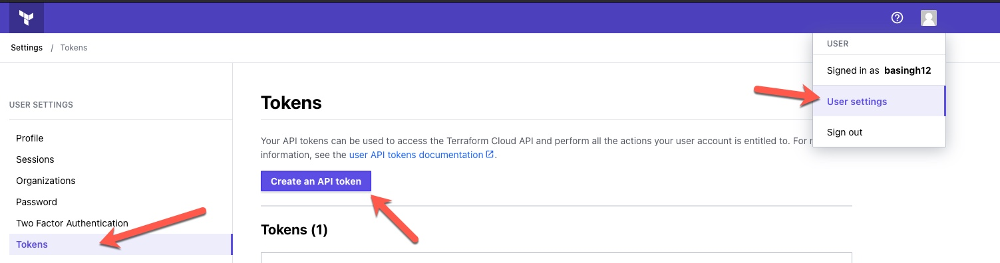

##### Setup demo for Terraform cloud secret engine on Vault. 

This script is to setup a terraform cloud secret engine on Hashicorp Vault. 
There are few things you need to setup before running this script. 

1. Fetch Terraform Cloud API token: You can do this by going into profile section of Terraform cloud -> Tokens -> Create an API token



2. Copy the token and set it as environment variable on your terminal `export TF_TOKEN=<Copied Token>`. 
3. Login into vault with appropriate policy attached, in general :

```
# Mount secrets engines
path "sys/mounts/*" {
  capabilities = [ "create", "read", "update", "delete", "list" ]
}

# Configure the Terraform Cloud secrets engine and create roles
path "terraform/*" {
  capabilities = [ "create", "read", "update", "delete", "list" ]
}

# Manage the leases
path "sys/leases/+/terraform/creds/my-user/*" {
  capabilities = [ "create", "read", "update", "delete", "list", "sudo" ]
}

path "sys/leases/+/terraform/creds/my-user" {
  capabilities = [ "create", "read", "update", "delete", "list", "sudo" ]
}

# Write ACL policies
path "sys/policies/acl/*" {
  capabilities = [ "create", "read", "update", "delete", "list" ]
}

# Manage tokens for verification
path "auth/token/create" {
  capabilities = [ "create", "read", "update", "delete", "list", "sudo" ]
}

```

4.  Run the script `tfcloud.sh` on your vault instance or with terminal pointing to VAULT ADDR.
```
$ ./tfcloud.sh
```

5. Script will set up your terraform cloud secret engine along with requesting dynamic credential from Terraform Cloud. 

```
Success! Data written to: terraform/role/my-user
Key                Value
---                -----
lease_id           terraform/creds/my-user/CxxxxxxxxxP
lease_duration     2m
lease_renewable    true
token              3n7xxxxxxxo
token_id           at-dxxxxxxW
```

All done!